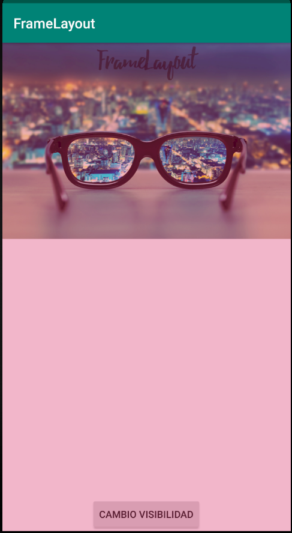

# Ejercicio FrameLayout
En este ejercicio se muestra una vista que tiene como layout principal
un `FrameLayout` con un color rosa transparente. Se inserta un texto con
una fuente personalizada mediante el recurso `/res/font`. En este caso
las fuentes se compilan como en el archvo `R` y están disponibles en el
sistema como un recurso más.

Además modificamos la visibilidad del componente `TextView` mediante el
atributo `android:visibility` que contiene tres valores:
`VISIBLE`,`INVISIBLE`y `GONE`.

Finalmente aplicamos la gravedad del botón respecto al componente padre,
es decir el `FrameLayout` mediante el atributo `android:layout_gravity`.

